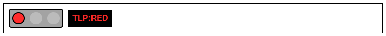
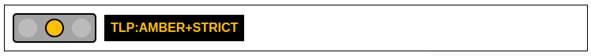
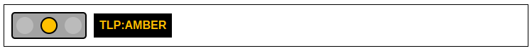
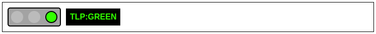
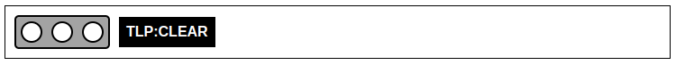

# TLP HTML Snippets

- [Traffic Light Protocol TLP-Banners/TLP) 2.0](https://www.cisa.gov/news-events/news/traffic-light-protocol-tlp-definitions-and-usage)
- [TLP Users Guide 2.0](https://www.cisa.gov/sites/default/files/2023-02/tlp-2-0-user-guide_508c.pdf)

The [Traffic Light Protocol (TLP)](https://en.wikipedia.org/wiki/Traffic_Light_Protocol) is a system for classifying sensitive information created in the early 2000s by the UK Government's National Infrastructure Security Co-ordination Centre, in order to encourage greater sharing of sensitive information.  And was adopted by the U.S. Cybersecurity & Infrastructure Security Agency (CISA) in [2022](https://www.cisa.gov/news-events/news/traffic-light-protocol-tlp-definitions-and-usage).

ACEP faculty, staff and students should add the respective TLP banner to the **header** and **footer** of documents containing sensitive information to clearly indicate acceptable audiences for which the information in the document can be shared.

## ACEP TLP 2.0 Banner Snippets


```html
<a title="TLP:RED - Not for disclosure, restricted to participants only." href="https://www.cisa.gov/news-events/news/traffic-light-protocol-tlp-definitions-and-usage" target="_blank" style="text-decoration: none;">
    <div id="tlp-red-banner" style="position: relative; width: 100%; left: calc(-1 * var(--body-margin-left, 0px)); padding: 0px;">
        <div id="tlp-red-banner-content" style="display: flex; justify-content: space-between; align-items: center; padding-top: 0px; padding-bottom: 0px; padding-left: 10px; padding-right: 10px; color: #FFFFFF; background-color: #ffffff; border: 1px solid #000000;">
            <!-- Left section: TLP label -->
            <div style="display: flex; gap: 10px; align-items: center;">
                <div style="display: flex; gap: 10px; border: 2px solid #000000; border-radius: 5px; background-color: #a3a3a3; padding: 5px; width: max-content;">
                    <div style="width: 20px; height: 20px; border: 2px solid #000000; border-radius: 50%; background-color: #FF2B2B;"></div>
                    <div style="width: 20px; height: 20px; border: 2px solid #bbbbbb; border-radius: 50%; background-color: #bbbbbb;"></div>
                    <div style="width: 20px; height: 20px; border: 2px solid #bbbbbb; border-radius: 50%; background-color: #bbbbbb;"></div>
                </div>
                <span style="font-weight: bold; font-size: 12pt; font-family: Helvetica, Arial, sans-serif; color: #FF2B2B; background-color: #000000; padding: 8px;">TLP:RED</span>
                <!-- <p style="font-size: 11pt; font-family: Helvetica, Arial, sans-serif; color: #FF2B2B; padding: 8px;">Not for disclosure, restricted to participants only.</p> -->
            </div>

            <!-- Right section: Logos -->
            <div style="display: flex; gap: 10px; align-items: center;">
                <p style="font-size: 11pt; font-family: Helvetica, Arial, sans-serif; color: #FF2B2B; padding: 8px;">Not for disclosure, restricted to participants only.</p>
                <a title="Alaska Center for Energy and Power" href="https://acep.uaf.edu/" target="_blank" style="text-decoration: none;"></a>
                <a title="University of Alaska Fairbanks" href="https://www.uaf.edu/" target="_blank" style="text-decoration: none;"></a>
            </div>
        </div>
    </div>
</a>
```


```html
<a title="TLP:AMBER+STRICT - Limited disclosure, restricted to participants’ organization." href="https://www.cisa.gov/news-events/news/traffic-light-protocol-tlp-definitions-and-usage" target="_blank" style="text-decoration: none;">
    <div id="tlp-amber-strict-banner" style="position: relative; width: 100%; left: calc(-1 * var(--body-margin-left, 0px)); padding: 0px;">
        <div id="tlp-amber-strict-banner-content" style="display: flex; justify-content: space-between; align-items: center; padding-top: 0px; padding-bottom: 0px; padding-left: 10px; padding-right: 10px; color: #FFFFFF; background-color: #ffffff; border: 1px solid #000000;">
            <!-- Left section: TLP label -->
            <div style="display: flex; gap: 10px; align-items: center;">
                <div style="display: flex; gap: 10px; border: 2px solid #000000; border-radius: 5px; background-color: #a3a3a3; padding: 5px; width: max-content;">
                    <div style="width: 20px; height: 20px; border: 2px solid #bbbbbb; border-radius: 50%; background-color: #bbbbbb;"></div>
                    <div style="width: 20px; height: 20px; border: 2px solid #000000; border-radius: 50%; background-color: #FFC000;"></div>
                    <div style="width: 20px; height: 20px; border: 2px solid #bbbbbb; border-radius: 50%; background-color: #bbbbbb;"></div>
                </div>
                <span style="font-weight: bold; font-size: 12pt; font-family: Helvetica, Arial, sans-serif; color: #FFC000; background-color: #000000; padding: 8px;">TLP:AMBER+STRICT</span>
                <!-- <p style="font-size: 11pt; font-family: Helvetica, Arial, sans-serif; color: #FFC000; padding: 8px;">Limited disclosure, restricted to participants’ organization.</p> -->
            </div>

            <!-- Right section: Logos -->
            <div style="display: flex; gap: 10px; align-items: center;">
                <p style="font-size: 11pt; font-family: Helvetica, Arial, sans-serif; color: #FFC000; padding: 8px;">Limited disclosure, restricted to participants’ organization.</p>
                <a title="Alaska Center for Energy and Power" href="https://acep.uaf.edu/" target="_blank" style="text-decoration: none;"></a>
                <a title="University of Alaska Fairbanks" href="https://www.uaf.edu/" target="_blank" style="text-decoration: none;"></a>
            </div>
        </div>
    </div>
</a>
```


```html
<a title="TLP:AMBER - Limited disclosure, restricted to participants’ organization and its clients." href="https://www.cisa.gov/news-events/news/traffic-light-protocol-tlp-definitions-and-usage" target="_blank" style="text-decoration: none;">
    <div id="tlp-amber-banner" style="position: relative; width: 100%; left: calc(-1 * var(--body-margin-left, 0px)); padding: 0px;">
        <div id="tlp-amber-banner-content" style="display: flex; justify-content: space-between; align-items: center; padding-top: 0px; padding-bottom: 0px; padding-left: 10px; padding-right: 10px; color: #FFFFFF; background-color: #ffffff; border: 1px solid #000000;">
            <!-- Left section: TLP label -->
            <div style="display: flex; gap: 10px; align-items: center;">
                <div style="display: flex; gap: 10px; border: 2px solid #000000; border-radius: 5px; background-color: #a3a3a3; padding: 5px; width: max-content;">
                    <div style="width: 20px; height: 20px; border: 2px solid #bbbbbb; border-radius: 50%; background-color: #bbbbbb;"></div>
                    <div style="width: 20px; height: 20px; border: 2px solid #000000; border-radius: 50%; background-color: #FFC000;"></div>
                    <div style="width: 20px; height: 20px; border: 2px solid #bbbbbb; border-radius: 50%; background-color: #bbbbbb;"></div>
                </div>
                <span style="font-weight: bold; font-size: 12pt; font-family: Helvetica, Arial, sans-serif; color: #FFC000; background-color: #000000; padding: 8px;">TLP:AMBER</span>
                <!-- <p style="font-size: 11pt; font-family: Helvetica, Arial, sans-serif; color: #FFC000; padding: 8px;">Limited disclosure, restricted to participants’ organization and its clients.</p> -->
            </div>

            <!-- Right section: Logos -->
            <div style="display: flex; gap: 10px; align-items: center;">
                <p style="font-size: 11pt; font-family: Helvetica, Arial, sans-serif; color: #FFC000; padding: 8px;">Limited disclosure, restricted to participants’ organization and its clients.</p>
                <a title="Alaska Center for Energy and Power" href="https://acep.uaf.edu/" target="_blank" style="text-decoration: none;"></a>
                <a title="University of Alaska Fairbanks" href="https://www.uaf.edu/" target="_blank" style="text-decoration: none;"></a>
            </div>
        </div>
    </div>
</a>
```


```html
<a title="TLP:GREEN - Limited disclosure, restricted to the community." href="https://www.cisa.gov/news-events/news/traffic-light-protocol-tlp-definitions-and-usage" target="_blank" style="text-decoration: none;">
    <div id="tlp-green-banner" style="position: relative; width: 100%; left: calc(-1 * var(--body-margin-left, 0px)); padding: 0px;">
            <div id="tlp-green-banner-content" style="display: flex; justify-content: space-between; align-items: center; padding-top: 0px; padding-bottom: 0px; padding-left: 10px; padding-right: 10px; color: #FFFFFF; background-color: #ffffff; border: 1px solid #000000;">
                <!-- Left section: TLP label -->
                <div style="display: flex; gap: 10px; align-items: center;">    
                <div style="display: flex; gap: 10px; border: 2px solid #000000; border-radius: 5px; background-color: #a3a3a3; padding: 5px; width: max-content;">
                    <div style="width: 20px; height: 20px; border: 2px solid #bbbbbb; border-radius: 50%; background-color: #bbbbbb;"></div>
                    <div style="width: 20px; height: 20px; border: 2px solid #bbbbbb; border-radius: 50%; background-color: #bbbbbb;"></div>
                    <div style="width: 20px; height: 20px; border: 2px solid #000000; border-radius: 50%; background-color: #33FF00;"></div>
                </div>
                <span style="font-weight: bold; font-size: 12pt; font-family: Helvetica, Arial, sans-serif; color: #33FF00; background-color: #000000; padding: 8px;">TLP:GREEN</span>
                <!-- <p style="font-size: 11pt; font-family: Helvetica, Arial, sans-serif; color: #33FF00; padding: 8px;">Limited disclosure, restricted to the community.</p> -->
            </div>

            <!-- Right section: Logos -->
            <div style="display: flex; gap: 10px; align-items: center;">
                <p style="font-size: 11pt; font-family: Helvetica, Arial, sans-serif; color: #3dc51b; padding: 8px;">Limited disclosure, restricted to the community.</p>
                <a title="Alaska Center for Energy and Power" href="https://acep.uaf.edu/" target="_blank" style="text-decoration: none;"></a>
                <a title="University of Alaska Fairbanks" href="https://www.uaf.edu/" target="_blank" style="text-decoration: none;"></a>
            </div>
        </div>
    </div>
</a>
```


```html
<a title="TLP:CLEAR - Disclosure is not limited." href="https://www.cisa.gov/news-events/news/traffic-light-protocol-tlp-definitions-and-usage" target="_blank" style="text-decoration: none;">
    <div id="tlp-clear-banner" style="position: relative; width: 100%; left: calc(-1 * var(--body-margin-left, 0px)); padding: 0px;">
        <div id="tlp-clear-banner-content" style="display: flex; justify-content: space-between; align-items: center; padding-top: 0px; padding-bottom: 0px; padding-left: 10px; padding-right: 10px; color: #FFFFFF; background-color: #ffffff; border: 1px solid #000000;">
            <!-- Left section: TLP label -->
            <div style="display: flex; gap: 10px; align-items: center;">
                <div style="display: flex; gap: 10px; border: 2px solid #000000; border-radius: 5px; background-color: #a3a3a3; padding: 5px; width: max-content;">
                    <div style="width: 20px; height: 20px; border: 2px solid #000000; border-radius: 50%; background-color: #FFFFFF;"></div>
                    <div style="width: 20px; height: 20px; border: 2px solid #000000; border-radius: 50%; background-color: #FFFFFF;"></div>
                    <div style="width: 20px; height: 20px; border: 2px solid #000000; border-radius: 50%; background-color: #FFFFFF;"></div>
                </div>
                <span style="font-weight: bold; font-size: 12pt; font-family: Helvetica, Arial, sans-serif; color: #FFFFFF; background-color: #000000; padding: 8px;">TLP:CLEAR</span>
                <!-- <p style="font-size: 11pt; font-family: Helvetica, Arial, sans-serif; color: #000000; padding: 8px;">Disclosure is not limited.</p> -->
            </div>

            <!-- Right section: Logos -->
            <div style="display: flex; gap: 10px; align-items: center;">
                <p style="font-size: 11pt; font-family: Helvetica, Arial, sans-serif; color: #000000; padding: 8px;">Disclosure is not limited.</p>
                <a title="Alaska Center for Energy and Power" href="https://acep.uaf.edu/" target="_blank" style="text-decoration: none;"></a>
                <a title="University of Alaska Fairbanks" href="https://www.uaf.edu/" target="_blank" style="text-decoration: none;"></a>
            </div>
        </div>
    </div>
</a>
```

---

## TLP 2.0 Banner Snippets

Place the approppriate TLP banner at the top and bottom (header and footer) of senstive content pages to communicate content sharing restrictions.



Not for disclosure, restricted to participants only.
```
<a title="TLP:RED - Not for disclosure, restricted to participants only." href="https://www.cisa.gov/news-events/news/traffic-light-protocol-tlp-definitions-and-usage" target="_blank" style="text-decoration: none;">
    <div id="tlp-red-banner" style="position: relative; width: 100%; left: calc(-1 * var(--body-margin-left, 0px)); padding: 0px;">
        <div id="tlp-red-banner-content" style="display: flex; gap: 10px; align-items: center; left; margin: 0px; padding: 10px; color: #FFFFFF; background-color: #ffffff; border: 1px solid #000000;">
            <div style="display: flex; gap: 10px; border: 2px solid #000000; border-radius: 5px; background-color: #a3a3a3; padding: 5px; width: max-content;">
                <div style="width: 20px; height: 20px; border: 2px solid #000000; border-radius: 50%; background-color: #FF2B2B;"></div>
                <div style="width: 20px; height: 20px; border: 2px solid #bbbbbb; border-radius: 50%; background-color: #bbbbbb;"></div>
                <div style="width: 20px; height: 20px; border: 2px solid #bbbbbb; border-radius: 50%; background-color: #bbbbbb;"></div>
            </div>
            <span style="font-weight: bold; font-size: 12pt; font-family: Helvetica, Arial, sans-serif; color: #FF2B2B; background-color: #000000; padding: 8px;">TLP:RED</span>
        </div>
    </div>
</a>
```



Limited disclosure, restricted to participants’ organization.
```
<a title="TLP:AMBER+STRICT - Limited disclosure, restricted to participants’ organization." href="https://www.cisa.gov/news-events/news/traffic-light-protocol-tlp-definitions-and-usage" target="_blank" style="text-decoration: none;">
    <div id="tlp-amber-strict-banner" style="position: relative; width: 100%; left: calc(-1 * var(--body-margin-left, 0px)); padding: 0px;">
        <div id="tlp-amber-strict-banner-content" style="display: flex; gap: 10px; align-items: center; left; margin: 0px; padding: 10px; color: #FFFFFF; background-color: #ffffff; border: 1px solid #000000;">
            <div style="display: flex; gap: 10px; border: 2px solid #000000; border-radius: 5px; background-color: #a3a3a3; padding: 5px; width: max-content;">
                <div style="width: 20px; height: 20px; border: 2px solid #bbbbbb; border-radius: 50%; background-color: #bbbbbb;"></div>
                <div style="width: 20px; height: 20px; border: 2px solid #000000; border-radius: 50%; background-color: #FFC000;"></div>
                <div style="width: 20px; height: 20px; border: 2px solid #bbbbbb; border-radius: 50%; background-color: #bbbbbb;"></div>
            </div>
            <span style="font-weight: bold; font-size: 12pt; font-family: Helvetica, Arial, sans-serif; color: #FFC000; background-color: #000000; padding: 8px;">TLP:AMBER+STRICT</span>
        </div>
    </div>
</a>
```



Limited disclosure, restricted to participants’ organization and its clients (see Terminology Definitions).
```
<a title="TLP:AMBER - Limited disclosure, restricted to participants’ organization and its clients (see Terminology Definitions)." href="https://www.cisa.gov/news-events/news/traffic-light-protocol-tlp-definitions-and-usage" target="_blank" style="text-decoration: none;">
    <div id="tlp-amber-banner" style="position: relative; width: 100%; left: calc(-1 * var(--body-margin-left, 0px)); padding: 0px;">
        <div id="tlp-amber-banner-content" style="display: flex; gap: 10px; align-items: center; left; margin: 0px; padding: 10px; color: #FFFFFF; background-color: #ffffff; border: 1px solid #000000;">
            <div style="display: flex; gap: 10px; border: 2px solid #000000; border-radius: 5px; background-color: #a3a3a3; padding: 5px; width: max-content;">
                <div style="width: 20px; height: 20px; border: 2px solid #bbbbbb; border-radius: 50%; background-color: #bbbbbb;"></div>
                <div style="width: 20px; height: 20px; border: 2px solid #000000; border-radius: 50%; background-color: #FFC000;"></div>
                <div style="width: 20px; height: 20px; border: 2px solid #bbbbbb; border-radius: 50%; background-color: #bbbbbb;"></div>
            </div>
            <span style="font-weight: bold; font-size: 12pt; font-family: Helvetica, Arial, sans-serif; color: #FFC000; background-color: #000000; padding: 8px;">TLP:AMBER</span>
        </div>
    </div>
</a>
```



Limited disclosure, restricted to the community.
```
<a title="TLP:GREEN - Limited disclosure, restricted to the community." href="https://www.cisa.gov/news-events/news/traffic-light-protocol-tlp-definitions-and-usage" target="_blank" style="text-decoration: none;">
    <div id="tlp-green-banner" style="position: relative; width: 100%; left: calc(-1 * var(--body-margin-left, 0px)); padding: 0px;">
        <div id="tlp-green-banner-content" style="display: flex; gap: 10px; align-items: center; left; margin: 0px; padding: 10px; color: #FFFFFF; background-color: #ffffff; border: 1px solid #000000;">
            <div style="display: flex; gap: 10px; border: 2px solid #000000; border-radius: 5px; background-color: #a3a3a3; padding: 5px; width: max-content;">
                <div style="width: 20px; height: 20px; border: 2px solid #bbbbbb; border-radius: 50%; background-color: #bbbbbb;"></div>
                <div style="width: 20px; height: 20px; border: 2px solid #bbbbbb; border-radius: 50%; background-color: #bbbbbb;"></div>
                <div style="width: 20px; height: 20px; border: 2px solid #000000; border-radius: 50%; background-color: #33FF00;"></div>
            </div>
            <span style="font-weight: bold; font-size: 12pt; font-family: Helvetica, Arial, sans-serif; color: #33FF00; background-color: #000000; padding: 8px;">TLP:GREEN</span>
        </div>
    </div>
</a>
```



 Disclosure is not limited.
```
<a title="TLP:CLEAR - Disclosure is not limited." href="https://www.cisa.gov/news-events/news/traffic-light-protocol-tlp-definitions-and-usage" target="_blank" style="text-decoration: none;">
    <div id="tlp-clear-banner" style="position: relative; width: 100%; left: calc(-1 * var(--body-margin-left, 0px)); padding: 0px;">
        <div id="tlp-clear-banner-content" style="display: flex; gap: 10px; align-items: center; left; margin: 0px; padding: 10px; color: #FFFFFF; background-color: #ffffff; border: 1px solid #000000;">
            <div style="display: flex; gap: 10px; border: 2px solid #000000; border-radius: 5px; background-color: #a3a3a3; padding: 5px; width: max-content;">
                <div style="width: 20px; height: 20px; border: 2px solid #000000; border-radius: 50%; background-color: #FFFFFF;"></div>
                <div style="width: 20px; height: 20px; border: 2px solid #000000; border-radius: 50%; background-color: #FFFFFF;"></div>
                <div style="width: 20px; height: 20px; border: 2px solid #000000; border-radius: 50%; background-color: #FFFFFF;"></div>
            </div>
            <span style="font-weight: bold; font-size: 12pt; font-family: Helvetica, Arial, sans-serif; color: #FFFFFF; background-color: #000000; padding: 8px;">TLP:CLEAR</span>
        </div>
    </div>
</a>
```

<!-- ---

## TLP Color Chart

**TLP Definition** | **HTML Color**
--- | ---
<span style="font-weight: bold; color: #FF2B2B; background-color: #000000; padding-left: 10px; padding-right: 75px">TLP:RED</span> | <span style="font-weight: bold; color: #FF2B2B; background-color: #000000; padding-left: 10px; padding-right: 10px">#FF2B2B</span>
<span style="font-weight: bold; color: #FFC000; background-color: #000000; padding-left: 10px; padding-right: 55px">TLP:AMBER</span> | <span style="font-weight: bold; color: #FFC000; background-color: #000000; padding-left: 10px; padding-right: 10px">#FFC000</span>
<span style="font-weight: bold; color: #FFC000; background-color: #000000; padding-left: 10px; padding-right: 10px">TLP:AMBER+STICT</span> | <span style="font-weight: bold; color: #FFC000; background-color: #000000; padding-left: 10px; padding-right: 10px">#FFC000</span>
<span style="font-weight: bold; color: #33FF00; background-color: #000000; padding-left: 10px; padding-right: 58px">TLP:GREEN</span> | <span style="font-weight: bold; color: #33FF00; background-color: #000000; padding-left: 10px; padding-right: 10px">#33FF00</span>
<span style="font-weight: bold; color: #FFFFFF; background-color: #000000; padding-left: 10px; padding-right: 62px">TLP:CLEAR</span> | <span style="font-weight: bold; color: #FFFFFF; background-color: #000000; padding-left: 10px; padding-right: 10px">#FFFFFF</span> -->

