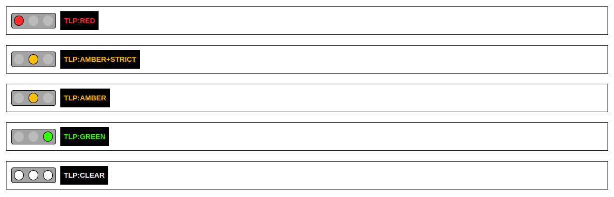

# TLP HTML Snippets

- [Traffic Light Protocol (TLP) 2.0](https://www.cisa.gov/news-events/news/traffic-light-protocol-tlp-definitions-and-usage)
- [TLP Users Guide 2.0](https://www.cisa.gov/sites/default/files/2023-02/tlp-2-0-user-guide_508c.pdf)

## TLP 2.0 Banner Snippets


```
<a title="TLP:RED - Not for disclosure, restricted to participants only." href="https://www.cisa.gov/news-events/news/traffic-light-protocol-tlp-definitions-and-usage" target="_blank" style="text-decoration: none;">
    <div id="tlp-red-banner" style="position: relative; width: 100%; left: calc(-1 * var(--body-margin-left, 0px)); padding: 0px;">
        <div id="tlp-red-banner-content" style="display: flex; gap: 10px; align-items: center; left; margin: 0px; padding: 10px; color: #FFFFFF; background-color: #ffffff; border: 1px solid #000000;">
            <div style="display: flex; gap: 10px; border: 2px solid #000000; border-radius: 5px; background-color: #a3a3a3; padding: 5px; width: max-content;">
                <div style="width: 20px; height: 20px; border: 2px solid #000000; border-radius: 50%; background-color: #FF2B2B;"></div>
                <div style="width: 20px; height: 20px; border: 2px solid #bbbbbb; border-radius: 50%; background-color: #bbbbbb;"></div>
                <div style="width: 20px; height: 20px; border: 2px solid #bbbbbb; border-radius: 50%; background-color: #bbbbbb;"></div>
            </div>
            <span style="font-weight: bold; font-size: 12pt; font-family: Helvetica, Arial, sans-serif; color: #FF2B2B; background-color: #000000; padding: 8px;">TLP:RED</span>
        </div>
    </div>
</a>

<br>

<a title="TLP:AMBER+STRICT - Limited disclosure, restricted to participants’ organization." href="https://www.cisa.gov/news-events/news/traffic-light-protocol-tlp-definitions-and-usage" target="_blank" style="text-decoration: none;">
    <div id="tlp-amber-strict-banner" style="position: relative; width: 100%; left: calc(-1 * var(--body-margin-left, 0px)); padding: 0px;">
        <div id="tlp-amber-strict-banner-content" style="display: flex; gap: 10px; align-items: center; left; margin: 0px; padding: 10px; color: #FFFFFF; background-color: #ffffff; border: 1px solid #000000;">
            <div style="display: flex; gap: 10px; border: 2px solid #000000; border-radius: 5px; background-color: #a3a3a3; padding: 5px; width: max-content;">
                <div style="width: 20px; height: 20px; border: 2px solid #bbbbbb; border-radius: 50%; background-color: #bbbbbb;"></div>
                <div style="width: 20px; height: 20px; border: 2px solid #000000; border-radius: 50%; background-color: #FFC000;"></div>
                <div style="width: 20px; height: 20px; border: 2px solid #bbbbbb; border-radius: 50%; background-color: #bbbbbb;"></div>
            </div>
            <span style="font-weight: bold; font-size: 12pt; font-family: Helvetica, Arial, sans-serif; color: #FFC000; background-color: #000000; padding: 8px;">TLP:AMBER+STRICT</span>
        </div>
    </div>
</a>

<br>    

<a title="TLP:AMBER - Limited disclosure, restricted to participants’ organization and its clients (see Terminology Definitions)." href="https://www.cisa.gov/news-events/news/traffic-light-protocol-tlp-definitions-and-usage" target="_blank" style="text-decoration: none;">
    <div id="tlp-amber-banner" style="position: relative; width: 100%; left: calc(-1 * var(--body-margin-left, 0px)); padding: 0px;">
        <div id="tlp-amber-banner-content" style="display: flex; gap: 10px; align-items: center; left; margin: 0px; padding: 10px; color: #FFFFFF; background-color: #ffffff; border: 1px solid #000000;">
            <div style="display: flex; gap: 10px; border: 2px solid #000000; border-radius: 5px; background-color: #a3a3a3; padding: 5px; width: max-content;">
                <div style="width: 20px; height: 20px; border: 2px solid #bbbbbb; border-radius: 50%; background-color: #bbbbbb;"></div>
                <div style="width: 20px; height: 20px; border: 2px solid #000000; border-radius: 50%; background-color: #FFC000;"></div>
                <div style="width: 20px; height: 20px; border: 2px solid #bbbbbb; border-radius: 50%; background-color: #bbbbbb;"></div>
            </div>
            <span style="font-weight: bold; font-size: 12pt; font-family: Helvetica, Arial, sans-serif; color: #FFC000; background-color: #000000; padding: 8px;">TLP:AMBER</span>
        </div>
    </div>
</a>

<br>    

<a title="TLP:GREEN - Limited disclosure, restricted to the community." href="https://www.cisa.gov/news-events/news/traffic-light-protocol-tlp-definitions-and-usage" target="_blank" style="text-decoration: none;">
    <div id="tlp-green-banner" style="position: relative; width: 100%; left: calc(-1 * var(--body-margin-left, 0px)); padding: 0px;">
        <div id="tlp-green-banner-content" style="display: flex; gap: 10px; align-items: center; left; margin: 0px; padding: 10px; color: #FFFFFF; background-color: #ffffff; border: 1px solid #000000;">
            <div style="display: flex; gap: 10px; border: 2px solid #000000; border-radius: 5px; background-color: #a3a3a3; padding: 5px; width: max-content;">
                <div style="width: 20px; height: 20px; border: 2px solid #bbbbbb; border-radius: 50%; background-color: #bbbbbb;"></div>
                <div style="width: 20px; height: 20px; border: 2px solid #bbbbbb; border-radius: 50%; background-color: #bbbbbb;"></div>
                <div style="width: 20px; height: 20px; border: 2px solid #000000; border-radius: 50%; background-color: #33FF00;"></div>
            </div>
            <span style="font-weight: bold; font-size: 12pt; font-family: Helvetica, Arial, sans-serif; color: #33FF00; background-color: #000000; padding: 8px;">TLP:GREEN</span>
        </div>
    </div>
</a>

<br>    

<a title="TLP:CLEAR - Disclosure is not limited." href="https://www.cisa.gov/news-events/news/traffic-light-protocol-tlp-definitions-and-usage" target="_blank" style="text-decoration: none;">
    <div id="tlp-clear-banner" style="position: relative; width: 100%; left: calc(-1 * var(--body-margin-left, 0px)); padding: 0px;">
        <div id="tlp-clear-banner-content" style="display: flex; gap: 10px; align-items: center; left; margin: 0px; padding: 10px; color: #FFFFFF; background-color: #ffffff; border: 1px solid #000000;">
            <div style="display: flex; gap: 10px; border: 2px solid #000000; border-radius: 5px; background-color: #a3a3a3; padding: 5px; width: max-content;">
                <div style="width: 20px; height: 20px; border: 2px solid #000000; border-radius: 50%; background-color: #FFFFFF;"></div>
                <div style="width: 20px; height: 20px; border: 2px solid #000000; border-radius: 50%; background-color: #FFFFFF;"></div>
                <div style="width: 20px; height: 20px; border: 2px solid #000000; border-radius: 50%; background-color: #FFFFFF;"></div>
            </div>
            <span style="font-weight: bold; font-size: 12pt; font-family: Helvetica, Arial, sans-serif; color: #FFFFFF; background-color: #000000; padding: 8px;">TLP:CLEAR</span>
        </div>
    </div>
</a>
```

## TLP Color Chart

**TLP Definition** | **HTML Color**
--- | ---
<span style="font-weight: bold; color: #FF2B2B; background-color: #000000; padding-left: 10px; padding-right: 75px">TLP:RED</span> | <span style="font-weight: bold; color: #FF2B2B; background-color: #000000; padding-left: 10px; padding-right: 10px">#FF2B2B</span>
<span style="font-weight: bold; color: #FFC000; background-color: #000000; padding-left: 10px; padding-right: 55px">TLP:AMBER</span> | <span style="font-weight: bold; color: #FFC000; background-color: #000000; padding-left: 10px; padding-right: 10px">#FFC000</span>
<span style="font-weight: bold; color: #FFC000; background-color: #000000; padding-left: 10px; padding-right: 10px">TLP:AMBER+STICT</span> | <span style="font-weight: bold; color: #FFC000; background-color: #000000; padding-left: 10px; padding-right: 10px">#FFC000</span>
<span style="font-weight: bold; color: #33FF00; background-color: #000000; padding-left: 10px; padding-right: 58px">TLP:GREEN</span> | <span style="font-weight: bold; color: #33FF00; background-color: #000000; padding-left: 10px; padding-right: 10px">#33FF00</span>
<span style="font-weight: bold; color: #FFFFFF; background-color: #000000; padding-left: 10px; padding-right: 62px">TLP:CLEAR</span> | <span style="font-weight: bold; color: #FFFFFF; background-color: #000000; padding-left: 10px; padding-right: 10px">#FFFFFF</span>

